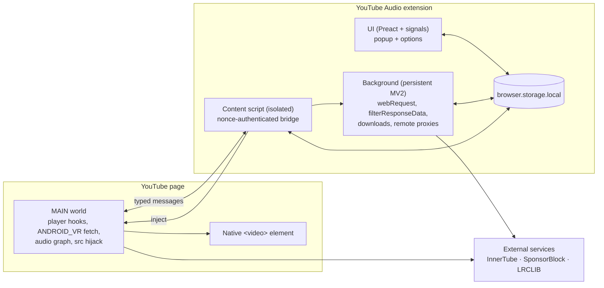

<div align="center">


# YouTube Audio

**Listen to YouTube and YouTube Music without downloading the video.**
A Firefox extension that plays only the audio, so your battery and your data plan last longer.

[](https://github.com/animeshkundu/youtube-audio/actions/workflows/ci.yml)
[](LICENSE)
[](https://www.mozilla.org/firefox/)
[](#install)
[](tsconfig.json)
[](wxt.config.ts)

[Website](https://animeshkundu.github.io/youtube-audio) · [How it works](#how-it-works) · [Architecture](#architecture) · [Contributing](#contributing)

</div>

---

## Why

Streaming video you never look at burns battery, heats up your phone, and eats bandwidth. YouTube Audio stops the video bytes at the source and keeps the sound, turning any tab into a lightweight audio player. On top of that it folds in the extras people normally pay for: background and lock-screen playback, ad and tracker blocking, sponsor-segment skipping, and a set of YouTube Music enhancements.

Two things make it genuinely private:

- **Logged-out is the only supported mode.** The extension never needs, reads, or transmits your YouTube account.
- **The core media fetch is always credentialless.** Audio is resolved with `credentials: "omit"`, so no cookies ride along with the request that finds your track.

Simple by default, powerful on demand. Everything works the moment you install it, and every knob is one click away when you want it.

## Features

Every feature fails open: if anything goes wrong, native YouTube playback is left untouched.

| Feature                           | What it does                                                                                                                                                            | Default |
| --------------------------------- | ----------------------------------------------------------------------------------------------------------------------------------------------------------------------- | ------- |
| **Audio-only playback**           | Resolves a direct audio stream and points the page player at it, so video bytes stop while the native controls keep working.                                            | On      |
| **Background / lock-screen play** | Keeps audio going when the tab is hidden or the screen is locked, with OS media controls.                                                                               | On      |
| **Ghost tracking block**          | Cancels YouTube's first-party telemetry and attribution pings before they leave the browser. A conservative allowlist preserves everything playback needs.              | On      |
| **Aggressive telemetry mode**     | Extends the ghost policy to a broader set of diagnostic endpoints.                                                                                                      | Off     |
| **Ad blocking**                   | Prunes ad descriptors out of the InnerTube `player` and `next` responses, plus a small static page-world baseline.                                                      | On      |
| **Segment skipping**              | SponsorBlock-style auto-skip using a privacy-preserving hashed lookup (only a 4-character hash prefix leaves your machine). Defaults to `sponsor` and `music_offtopic`. | On      |
| **Force max quality**             | Caps playback resolution (off, or 144p through 1080p) to save even more bandwidth.                                                                                      | Off     |
| **Disable autoplay-next**         | Uses YouTube's own autonav toggle to stop the endless queue.                                                                                                            | Off     |
| **Hide distractions**             | Independently hide Shorts, recommendations, and comments via a single managed stylesheet.                                                                               | Off     |
| **Loudness normalization**        | Applies YouTube Music's per-track loudness value through a Web Audio gain stage so volume stays even.                                                                   | On      |
| **Equalizer**                     | A 5-band EQ (60 Hz, 250 Hz, 1 kHz, 4 kHz, 12 kHz; ±12 dB) chained into the same audio graph.                                                                            | Off     |
| **Synced lyrics**                 | Opt-in, time-synced lyrics from LRCLIB, fetched without credentials or referrer.                                                                                        | Off     |
| **Audio download**                | Save the current track as an audio file straight from a validated direct URL.                                                                                           | Off     |

<details>
<summary><strong>Defaults, at a glance</strong></summary>

On out of the box: audio-only, background play, ghost tracking block, ad blocking, segment skipping (`sponsor` + `music_offtopic`), and YouTube Music loudness normalization.

Off until you ask: aggressive telemetry, force-quality cap, disable autoplay-next, hide Shorts / recommendations / comments, equalizer, synced lyrics, and audio download.

</details>

## Install

> Production uses the single permanent add-on ID `youtube-audio@animesh.kundus.in` on the AMO listed channel, with AMO providing updates on Firefox desktop and Android. Beta builds use the same ID, are Mozilla-signed on the unlisted channel at distinct pre-release versions, and are installed by hand for testing. Audio download intentionally ships in the listed production build. See [ADR-0006](docs/adrs/0006-firefox-amo-distribution-and-beta-channel.md), [the beta workflow](.github/workflows/beta.yml), and [the on-demand AMO publishing workflow](.github/workflows/publish-amo.yml).

### Desktop (build from source)

Requires Node.js 20+.

```bash
git clone https://github.com/animeshkundu/youtube-audio
cd youtube-audio
npm ci
npm run build            # outputs .output/firefox-mv2/
```

Then load it into Firefox:

1. Open `about:debugging#/runtime/this-firefox`.
2. Click **Load Temporary Add-on**.
3. Select `.output/firefox-mv2/manifest.json`.

The extension activates automatically on `youtube.com`, `music.youtube.com`, `m.youtube.com`, and `youtube-nocookie.com`.

### Android

Firefox for Android is a first-class target (the manifest ships `gecko_android`, and the UI collapses into a touch-friendly quick-control surface). Production is distributed through the AMO listed channel under the same permanent add-on ID as desktop, so AMO remains the update authority on both platforms. Testers can install the same-ID, unlisted beta XPI through Settings, then "Install extension from file"; beta updates are manual. See [ADR-0006](docs/adrs/0006-firefox-amo-distribution-and-beta-channel.md) and [`RELEASE.md`](RELEASE.md) for the accepted distribution model.

## How it works

The classic trick for audio-only YouTube was to intercept the `mime=audio` media request and drop the video track. Modern YouTube broke that: its SABR / UMP streaming protocol no longer exposes a stable, separable audio request to intercept.

So the rebuild takes a different route:

1. In the page's `MAIN` world, it issues a credentialless InnerTube `/youtubei/v1/player` request using the **`ANDROID_VR`** client, with `credentials: "omit"`. That response includes a direct, playable audio URL.
2. A playability gate checks the response. Whenever the credentialless ANDROID_VR response comes back non-playable (live streams, made-for-kids, age-restricted, members-only, or otherwise unavailable), the video is handed back to normal playback untouched.
3. For everything else, it hijacks the page `<video>.src` and points it at the audio URL. The native player UI stays fully intact, but the browser stops fetching video bytes.

Because the resolver runs without credentials and the extension never touches your login, the whole flow works, and is only supported, while logged out.

## Architecture

One strict-TypeScript source tree, built with [WXT](https://wxt.dev). Manifest V2 is the shipping target because Firefox still supports blocking `webRequest` and `filterResponseData`; a Manifest V3 build is produced in parallel as a capability artifact. The extension is split into four layers with tight security boundaries. Page-derived data does cross between worlds through a nonce-authenticated bridge: a video ID for segment skipping, track metadata for lyrics, and, for downloads, the signed media URL all move from the page world through the isolated content script to the background. The background does not trust that input. It re-validates any download URL against a `googlevideo.com`-only host allowlist, sanitizes the download filename, and issues every remote request with `credentials: "omit"`.



| Layer                           | Runtime                     | Responsibility                                                                                                                                                                |
| ------------------------------- | --------------------------- | ----------------------------------------------------------------------------------------------------------------------------------------------------------------------------- |
| **Page world** (`MAIN`)         | Injected into the page      | The only layer that touches player APIs: ANDROID_VR fetch, playability gate, `<video>.src` hijack, Web Audio graph, segment seeking.                                          |
| **Content** (isolated)          | `document_start` on YouTube | Owns storage-backed settings and the validated, nonce-authenticated bridge to the page world.                                                                                 |
| **Background** (persistent MV2) | Extension process           | Privileged APIs: `webRequest` telemetry blocking, `filterResponseData` ad pruning, credentialless remote proxies, and downloads.                                              |
| **UI**                          | Popup + options             | Preact and `@preact/signals`, sharing one storage-backed settings model. Popup is a focused quick-control surface; options exposes every setting with progressive disclosure. |

More detail lives in [`docs/architecture/`](docs/architecture/README.md), with per-milestone flow diagrams for playback, telemetry, ad blocking, segment skipping, the Music extras, and download.

## Testing

Everything is validated without a human in the loop, and live YouTube is treated as a canary rather than a gate.

- **Unit tests** run on [Vitest](https://vitest.dev) with jsdom and V8 coverage. Core shared logic is unit-tested (InnerTube body builder, telemetry policy, ad pruner, SponsorBlock parsing and merging, audio graph, lyrics, quality-of-life, download, player) alongside the Preact popup and options UI, with the coverage-gated modules holding roughly 99% line and 95% branch coverage.
- **Hermetic Selenium bench** drives the real extension in Firefox against a local fake-YouTube fixture server, entirely offline and deterministic. Built behind a `BENCH=1` flag that never ships in production, it asserts audio-only playback, telemetry blocking, and that no view-count or tracking pings leak. It gates CI on every push and pull request.
- **Live canary probes** (`tests/e2e/probe-*.mjs`) exercise the flow against real YouTube to catch YouTube-side drift such as InnerTube shape changes, format shifts, and live handling. They run nightly and never gate a merge.
- **Android emulator E2E** runs the extension on Fenix (Firefox for Android) in an x86_64 emulator against live `m.youtube.com`, asserting the core audio-only hijack and its fallback path. It is a nightly, non-gating canary and does not cover the popup and options UI or lock-screen controls.

CI (`.github/workflows/ci.yml`) runs on every push and pull request: typecheck, lint, format check, unit tests with coverage, the MV2 build, `web-ext lint`, a parallel MV3 capability build, and the hermetic Selenium bench as a gating job. The live-YouTube and Android-emulator probes run nightly as non-gating canaries (`live-canary.yml` and `mobile-e2e.yml`).

## Development

```bash
npm ci                # install locked dependencies
npm run dev           # WXT dev server, Firefox MV2, live reload
npm run build         # production MV2 build  -> .output/firefox-mv2/
npm run build:mv3     # MV3 capability build  -> .output/firefox-mv3/
npm test              # Vitest unit tests with coverage
npm run test:bench    # hermetic Selenium bench (offline)
npm run lint          # ESLint
npm run typecheck     # tsc --noEmit (strict)
```

`npm run validate` runs the full local gate, and CI enforces formatting with `npm run format:check`. Format the tree locally with `npm run format`.

<details>
<summary><strong>Project layout</strong></summary>

```
youtube-audio/
├── entrypoints/          # WXT entrypoints
│   ├── background.ts     # persistent MV2 background
│   ├── content.ts        # isolated content script
│   ├── main-world.ts     # MAIN-world page hooks
│   ├── popup/            # Preact popup
│   ├── options/          # Preact options page
│   └── ui/               # shared tokens + components
├── src/shared/           # framework-neutral logic (fetch, policies, audio graph, ...)
├── tests/
│   ├── unit/             # Vitest unit + UI tests
│   └── e2e/              # bench, live probes, Android driver
├── docs/                 # MkDocs (Material) site source: architecture, specs, ADRs, research, history
├── scripts/              # build, sign, validate
├── mkdocs.yml            # docs site config
└── wxt.config.ts         # build + manifest config
```

</details>

## Documentation

- **Docs site:** <https://animeshkundu.github.io/youtube-audio>
- **Architecture:** [`docs/architecture/`](docs/architecture/README.md)
- **Specifications:** [`docs/specs/`](docs/specs/README.md)
- **Architecture Decision Records:** [`docs/adrs/`](docs/adrs/README.md)
- **Agent guide:** [`AGENTS.md`](AGENTS.md) and [`docs/agent-instructions/`](docs/agent-instructions/README.md)
- **Release and distribution guide:** [`RELEASE.md`](RELEASE.md)

## Contributing

Contributions are welcome. Start with [`CONTRIBUTING.md`](CONTRIBUTING.md). This repository is documentation-driven: write or update the spec in [`docs/specs/`](docs/specs/README.md) before you change behavior, keep coverage on new code, and run `npm run lint`, `npm run typecheck`, and `npm test` before opening a pull request.

Working with an AI agent? Read [`AGENTS.md`](AGENTS.md) and the full protocol in [`docs/agent-instructions/`](docs/agent-instructions/README.md) first.

Development happens on the `rebuild` branch; `master` is the default branch.

## License

Licensed under the [GNU General Public License v3.0](LICENSE).
