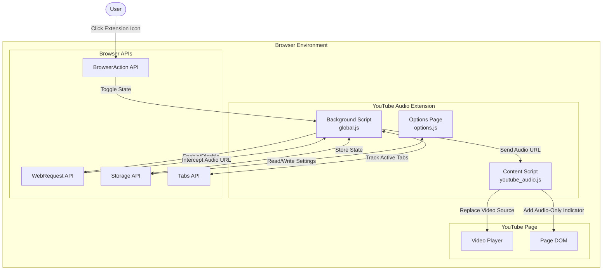
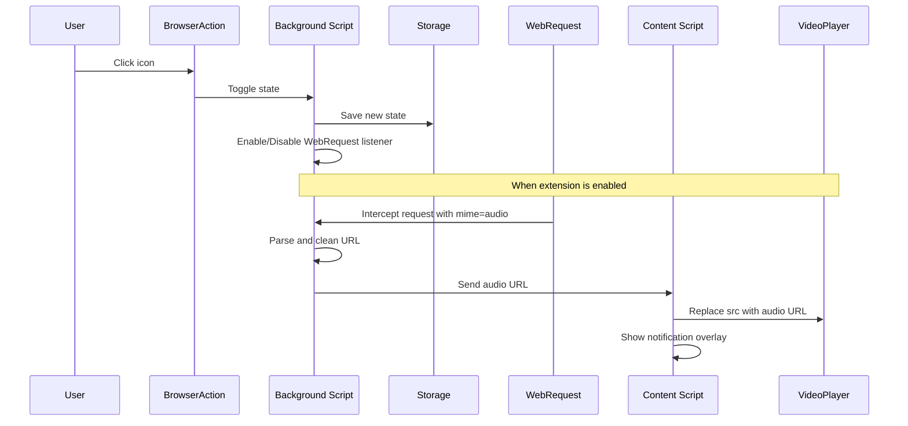

# Architecture Documentation

## Purpose

This folder contains high-level system architecture documentation using Mermaid.js diagrams and design documents.

## Current Architecture

### YouTube Audio Browser Extension Architecture

### Component Responsibilities

#### Background Script (`global.js`)

- Manages extension state (enabled/disabled)
- Intercepts WebRequests to detect audio streams
- Communicates audio URLs to content scripts
- Handles tab lifecycle management

#### Content Script (`youtube_audio.js`)

- Receives audio URLs from background script
- Replaces video source with audio-only stream
- Displays user notification overlay
- Respects user preferences from storage

#### Options Page (`options.js`)

- Provides user preferences UI
- Saves settings to browser storage

### Data Flow

## Adding Diagrams

### Mermaid.js Syntax

All diagrams should be written in Mermaid.js for version control and rendering in Markdown.

### Common Diagram Types

- **Flowchart**: System components and relationships
- **Sequence**: Data flow and interactions
- **Class**: Module structures
- **State**: State machines and transitions

### Resources

- [Mermaid Documentation](https://mermaid.js.org/intro/)
- [Mermaid Live Editor](https://mermaid.live)
