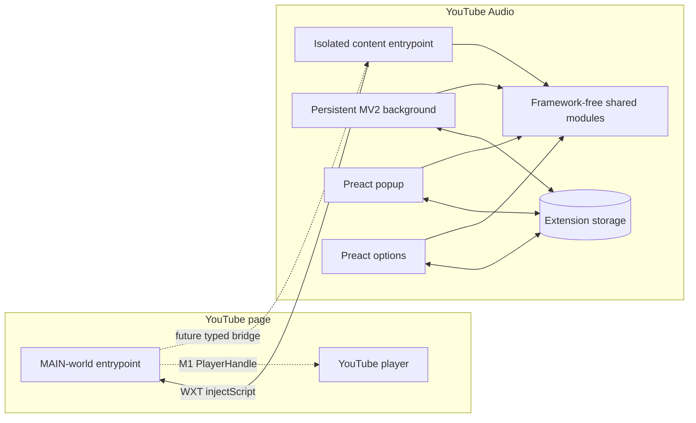
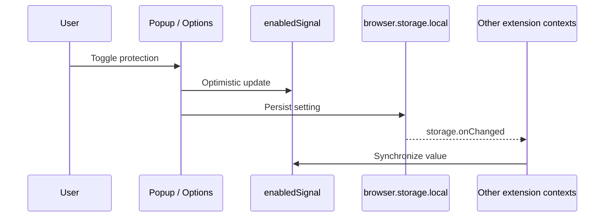
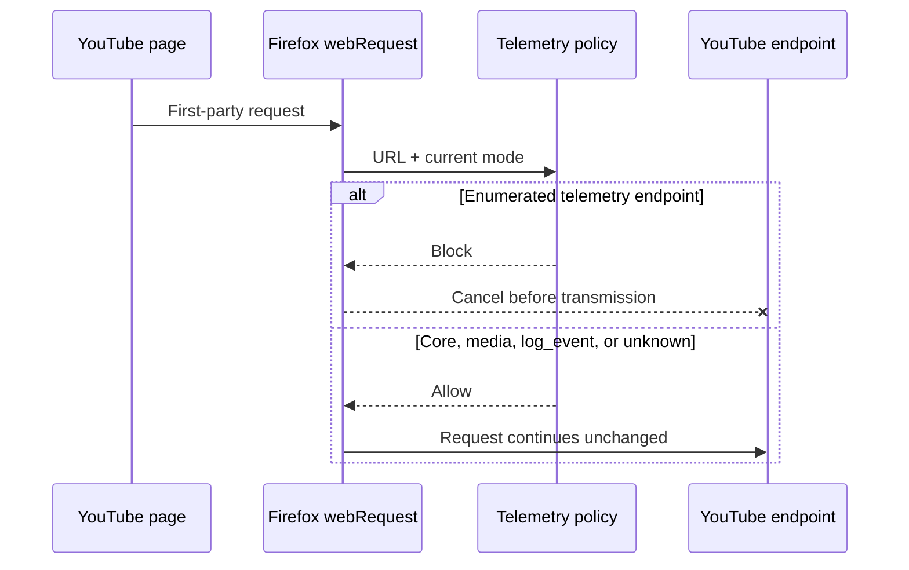
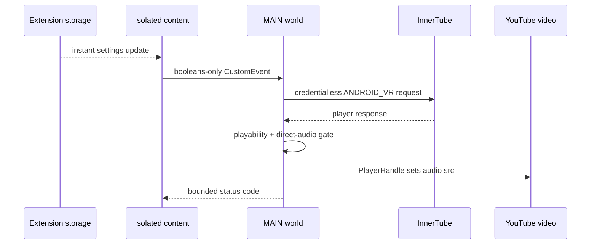
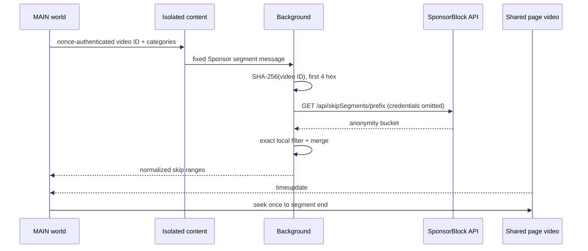
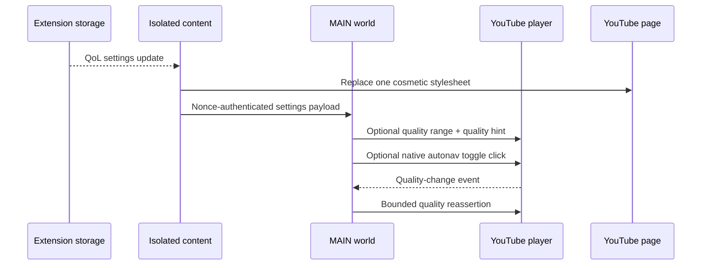
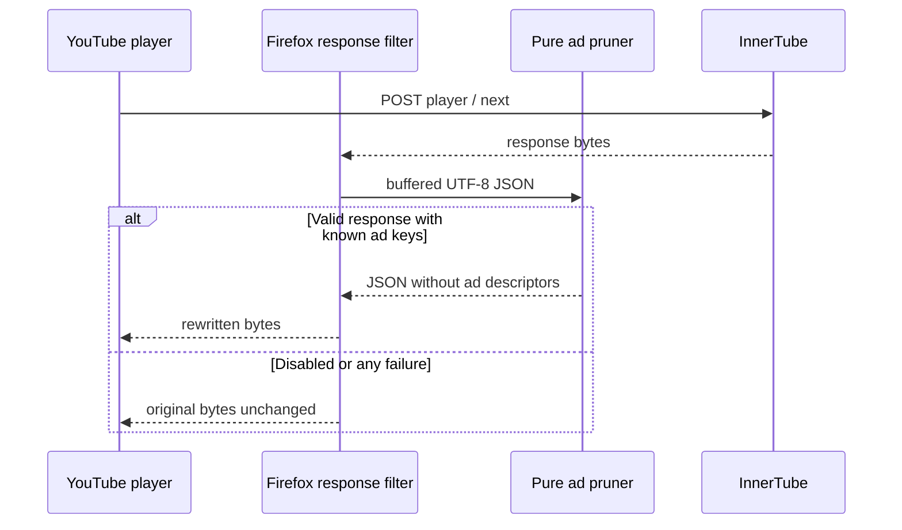
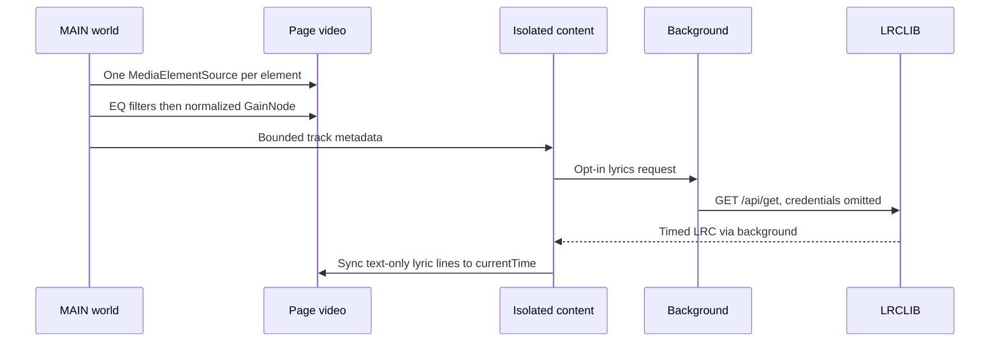
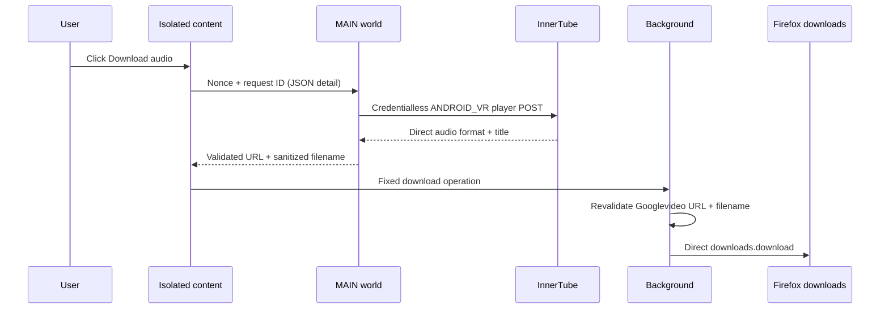
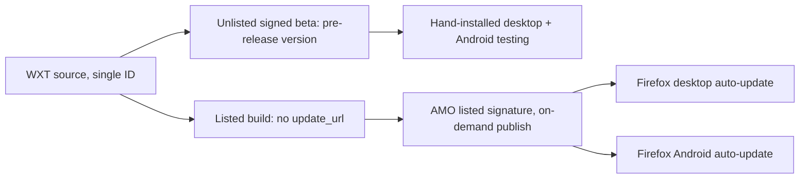

# Architecture Documentation

## M0 Architecture

YouTube Audio is a Firefox-first WebExtension built from one strict-TypeScript source tree. Firefox Manifest V2 is the shipping target; Firefox Manifest V3 is emitted as a capability artifact.

## Layer Responsibilities

### Background

The persistent MV2 background entrypoint owns privileged APIs, network adapters, downloads, and remote-service proxies. M2a installs an allowlist-based blocking `webRequest.onBeforeRequest` listener for first-party YouTube telemetry. Its conservative default preserves InnerTube player, attestation, Googlevideo media, `log_event`, and watch-history endpoints; errors fail open.

### Isolated content

The content entrypoint runs at `document_start` on the four supported YouTube match patterns. It injects the unlisted MAIN-world bundle and will later own validated cross-world messaging and DOM-facing features.

### MAIN world

The MAIN-world entrypoint is the only layer intended to touch YouTube player APIs and page-owned prototypes. M0 installs no hooks. M1 will implement the proven `<video>.src` hijack behind `PlayerHandle`.

### Shared modules

`src/shared/` contains framework-neutral contracts and pure logic. Feature modules are inert stubs in M0. The real ANDROID_VR request-body builder is implemented here and tested directly. `platform.ts` exposes manifest/background capability flags so later network interception and lifecycle logic can stay behind adapters.

### UI

Popup and options are extension-owned documents built with Preact and `@preact/signals`. They share one storage-backed settings model and reusable tokenized control kit. The desktop popup is a focused quick-control surface; the responsive options page repeats those quick controls first for Firefox Android, then exposes every setting through searchable groups and progressive disclosure. A separate local flag records the one-time onboarding panel without changing feature settings. Preact is not used in background, content, or page-world code.

## State Flow

## M2a Telemetry Flow

## Security Boundaries

- Page-world data is untrusted. No page-message handler exists in M0.
- The background never accepts arbitrary URLs.
- Only YouTube page patterns and `*.googlevideo.com` are granted.
- SponsorBlock access is limited to `https://sponsor.ajay.app/*`; LRCLIB remains ungranted until its feature lands.
- Feature failures must leave native YouTube behavior intact.

## M1 Playback Flow

The isolated content layer owns extension storage and sends a fixed boolean settings payload to MAIN world through a namespaced, same-origin `postMessage`. MAIN world owns the credentialless ANDROID_VR fetch, playability gate, SPA generation, visibility override, and `PlayerHandle`. `PlayerHandle` is the sole extension writer to the page video source. Only bounded status codes return to the isolated layer; signed media URLs and player responses remain in MAIN world.

Failures and unsupported videos fail open to native playback. SPA navigation invalidates stale asynchronous operations before they can attach media. On every teardown (global disable, navigate, re-attach, or circuit breaker) `PlayerHandle` never rewrites `<video>.src`; the captured native `blob:` source is backed by a discarded MediaSource and reassigning it would stall the element. A MAIN-world coordinator instead reclaims native playback in place through YouTube's own player API (`#movie_player.loadVideoById`) at the live position, pinned to the hijacked `videoId` and guarded by the element still holding the owned URL. The reclaim is one-shot and fail-open.

## M3a Segment-skip Flow

The persistent background hashes each video ID and requests only the four-character SHA-256 prefix from SponsorBlock with credentials omitted and no referrer. It filters the anonymity bucket locally and returns normalized, merged ranges through the isolated content bridge. MAIN world listens on the same `<video>` used by `PlayerHandle`, seeks to a range end at most once per navigation, and discards stale work after SPA navigation. No view-count, submission, voting, or plaintext-video-ID endpoint exists.

Any hashing, network, parsing, bridge, media, or seek failure returns an empty list or no-op and leaves native playback intact.

## M3b Quality-of-Life Flow

The isolated content layer turns the three cosmetic settings into one extension-managed stylesheet. It replaces the style text on instant storage changes and removes it when globally disabled, without exposing settings through persistent page attributes. The MAIN-world layer feature-detects the native player API for bounded quality-cap reassertion and uses YouTube's own autonav toggle when autoplay-next suppression is enabled.

Missing selectors, controls, and undocumented player methods are no-ops. No perpetual interval, page prototype patch, DOM deletion, or remote input is used.

## M2b Ad-block Flow

The persistent MV2 background owns deterministic response rewriting. For enabled `/youtubei/v1/player` and `/youtubei/v1/next` POSTs, Firefox `filterResponseData` buffers the original bytes, removes only the bundled allowlist of ad descriptor keys, and emits the rewritten JSON. Any stream, decoding, parsing, or serialization failure emits the original bytes unchanged. Disabling global protection or ad blocking leaves the response filter inert.

The MAIN-world entrypoint separately applies a small static operation baseline from `rescue.ts`. Its inline-response operation installs a reversible `ytInitialPlayerResponse` accessor and `JSON.parse` wrapper, pruning only parsed player responses that contain known ad keys. The dispatcher accepts only compiled operation IDs, catches failures per operation, and supports cleanup on instant settings changes. A best-effort native-function heuristic skips those hooks when another page-context blocker appears to have wrapped JSON parsing or serialization. The heuristic cannot reliably identify a particular extension because browser extension worlds are isolated. No rescue configuration or code is fetched remotely; that work remains gated on the post-S5 AMO preflight.

## M4 YouTube Music Extras Flow

The MAIN-world layer owns one shared Web Audio graph per media element. It reads YouTube's per-track loudness value from the already-requested player response, applies a bounded gain, and chains the user's five EQ bands in series. The isolated content layer requests lyrics only after explicit opt-in; background calls the fixed LRCLIB endpoint without credentials or referrer, and content renders timed text safely.

Any graph, metadata, bridge, remote, parse, or DOM failure is a no-op. Scrobbling is out of scope because it conflicts with ghost mode.

## M5 Audio Download Flow

An off-by-default in-player control initiates a fresh credentialless ANDROID_VR request in MAIN world. MAIN selects the preferred direct audio format and sends a nonce-authenticated JSON-string payload through isolated content. The background independently validates the Googlevideo URL and bounded canonical filename, then uses the downloads API directly. A credentialless Blob fallback is used only when the direct handoff fails.

Acquisition, bridge, validation, direct-download, and fallback failures return a bounded failure result and never alter playback.

## Release and Distribution

One source tree feeds a single Firefox add-on identity, `youtube-audio@animesh.kundus.in` (ADR-0006). Production is the AMO **listed** channel: the listed build omits `update_url`, and AMO is the sole update authority, delivering hands-off auto-update on Firefox desktop and Firefox for Android. A **beta** channel uses the same ID signed **unlisted** at a distinct pre-release version and is installed by hand for desktop and Android testing. Publishing to AMO is on demand (a manual run after testing), never automatic on a tag. AMO credentials (`AMO_JWT_ISSUER` / `AMO_JWT_SECRET`) exist only at signing time. The single ID is wired across `wxt.config.ts`, the bench `ADDON_ID`, and the workflows. `.github/workflows/beta.yml` signs the unlisted beta on a pre-release tag; `.github/workflows/publish-amo.yml` (manual `workflow_dispatch` only) signs the listed production version on demand. The self-hosted `updates.json` path from ADR-0004 is retired for production.

## Build Outputs

- `.output/firefox-mv2/`: shipping Firefox MV2 directory.
- `.output/firefox-mv3/`: Firefox MV3 capability directory.
- `dist/youtube-audio.xpi`: stable packaged MV2 artifact consumed by the Selenium harness.
- `dist/youtube-audio-<version>-signed.xpi`: Mozilla-signed unlisted release artifact (created only with AMO credentials).
