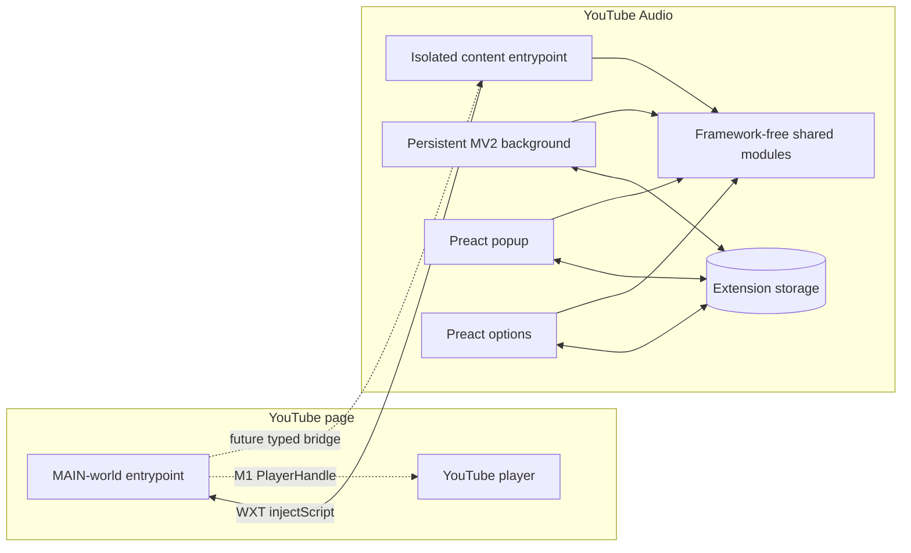
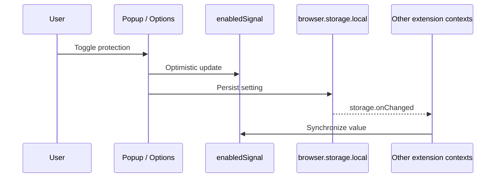
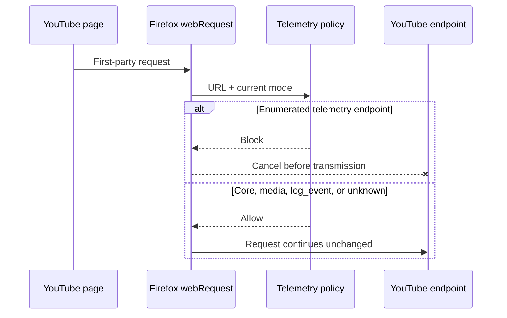
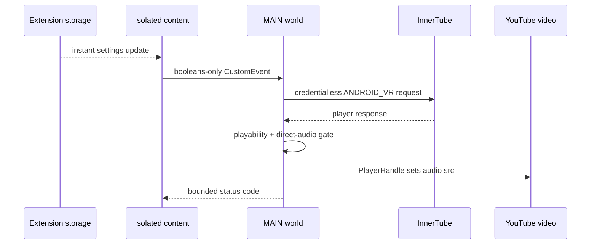
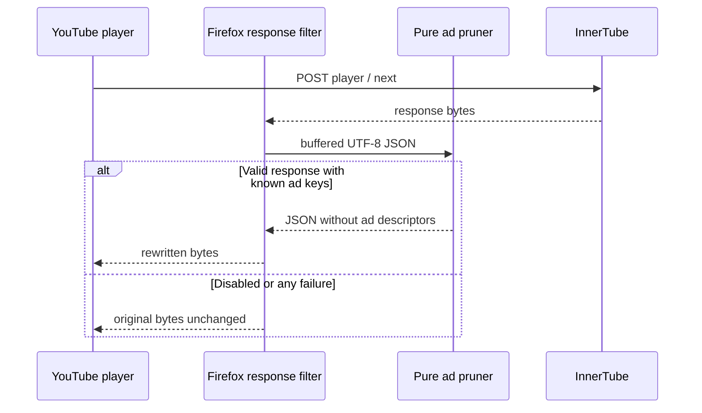

# Architecture Documentation

## M0 Architecture

YouTube Audio is a Firefox-first WebExtension built from one strict-TypeScript source tree. Firefox Manifest V2 is the shipping target; Firefox Manifest V3 is emitted as a capability artifact.

## Layer Responsibilities

### Background

The persistent MV2 background entrypoint owns privileged APIs, network adapters, downloads, and remote-service proxies. M2a installs an allowlist-based blocking `webRequest.onBeforeRequest` listener for first-party YouTube telemetry. Its conservative default preserves InnerTube player, attestation, Googlevideo media, `log_event`, and watch-history endpoints; errors fail open.

### Isolated content

The content entrypoint runs at `document_start` on the four supported YouTube match patterns. It injects the unlisted MAIN-world bundle and will later own validated cross-world messaging and DOM-facing features.

### MAIN world

The MAIN-world entrypoint is the only layer intended to touch YouTube player APIs and page-owned prototypes. M0 installs no hooks. M1 will implement the proven `<video>.src` hijack behind `PlayerHandle`.

### Shared modules

`src/shared/` contains framework-neutral contracts and pure logic. Feature modules are inert stubs in M0. The real ANDROID_VR request-body builder is implemented here and tested directly. `platform.ts` exposes manifest/background capability flags so later network interception and lifecycle logic can stay behind adapters.

### UI

Popup and options are extension-owned documents built with Preact and `@preact/signals`. They share the same storage-backed enabled state. Preact is not used in background, content, or page-world code.

## State Flow

## M2a Telemetry Flow

## Security Boundaries

- Page-world data is untrusted. No page-message handler exists in M0.
- The background never accepts arbitrary URLs.
- Only YouTube page patterns and `*.googlevideo.com` are granted.
- SponsorBlock and LRCLIB origins remain ungranted placeholders until their opt-in features land.
- Feature failures must leave native YouTube behavior intact.

## M1 Playback Flow

The isolated content layer owns extension storage and sends a fixed boolean settings payload to MAIN world through a namespaced, same-origin `postMessage`. MAIN world owns the credentialless ANDROID_VR fetch, playability gate, SPA generation, visibility override, and `PlayerHandle`. `PlayerHandle` is the sole extension writer to the page video source. Only bounded status codes return to the isolated layer; signed media URLs and player responses remain in MAIN world.

Failures and unsupported videos fail open to native playback. SPA navigation invalidates stale asynchronous operations before they can attach media.

## M2b Ad-block Flow

The persistent MV2 background owns deterministic response rewriting. For enabled `/youtubei/v1/player` and `/youtubei/v1/next` POSTs, Firefox `filterResponseData` buffers the original bytes, removes only the bundled allowlist of ad descriptor keys, and emits the rewritten JSON. Any stream, decoding, parsing, or serialization failure emits the original bytes unchanged. Disabling global protection or ad blocking leaves the response filter inert.

The MAIN-world entrypoint separately applies a small static operation baseline from `rescue.ts`. The dispatcher accepts only compiled operation IDs, catches failures per operation, and supports cleanup on instant settings changes. A best-effort native-function heuristic skips those hooks when another page-context blocker appears to have wrapped JSON parsing or serialization. The heuristic cannot reliably identify a particular extension because browser extension worlds are isolated. No rescue configuration or code is fetched remotely; that work remains gated on the post-S5 AMO preflight.

## Build Outputs

- `.output/firefox-mv2/`: shipping Firefox MV2 directory.
- `.output/firefox-mv3/`: Firefox MV3 capability directory.
- `dist/youtube-audio.xpi`: stable packaged MV2 artifact consumed by the Selenium harness.
