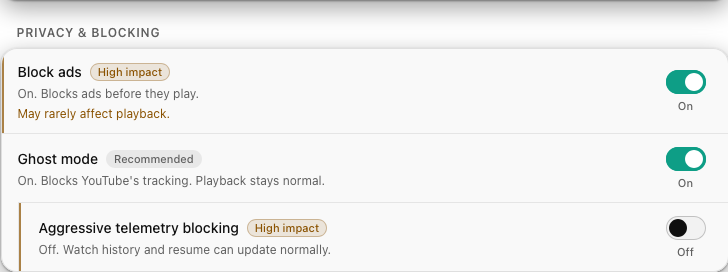
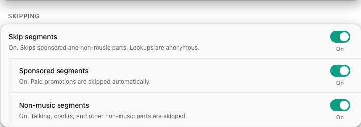

# Blocking ads, trackers, and sponsors

YouTube Audio quietly clears three kinds of noise out of the way: ads,
tracking, and the boring parts of a video. All of it is on by default where it
makes sense, and all of it fails open, so if anything ever looks wrong, normal
YouTube is right there.

<figure class="shot" markdown>

</figure>

## Ghost mode

Ghost mode blocks YouTube's telemetry: the little pings that report what you did
and when. They are dropped before they leave your browser, quietly, by default.

It is deliberately careful about what it blocks. The things that make YouTube
work normally when you are signed out, and that keep your watch position and
history behaving, are left alone. Ghost mode goes after the tracking, not the
plumbing.

If you want to go further, **Aggressive telemetry blocking** also stops the
watch-time and playback stats. That is more thorough, but it can make
"continue where you left off" and your history less reliable, so it is off
unless you turn it on, and the setting says so plainly.

## Ad blocking

The ad blocker works by editing YouTube's own player response: it strips the ad
slots out before the native player ever sees them, so there is nothing to play.
If the response is ever shaped in a way it does not recognise, it passes the
original through untouched rather than risk your playback.

## Skip the boring bits

Segment skipping is SponsorBlock-style auto-skip. It glides past sponsor reads
and off-topic music intros using the community's crowd-sourced timings, and you
can turn each category on or off.

<figure class="shot" markdown>

</figure>

The part worth bragging about is the privacy. To look up segments for a video,
the add-on hashes the video's id and sends only the **first four characters** of
that hash. That short prefix is shared by thousands of different videos, so
SponsorBlock hands back a whole bucket of possibilities and the matching happens
on your machine. The lookup carries no cookies and no referrer. Nobody on the
other end learns which video you are watching.

!!! note "Everything here fails open"
    Ad blocking, Ghost mode, and skipping are all built to get out of the way
    the instant they are not sure. A failed block, a response they do not
    recognise, a lookup that times out: every one of them quietly reverts to
    normal YouTube instead of breaking your playback.

Next: [YouTube Music, loudness and EQ :material-arrow-right:](music.md)
