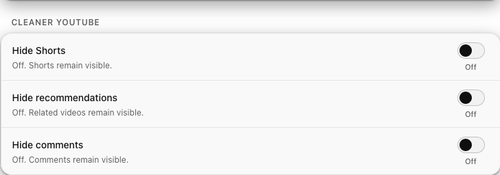

# A tidier YouTube

Beyond the audio itself, a handful of small comforts let you calm the page down
and save even more data. None of them are on by default: they wait until you
ask, and they only do the one thing you asked for.

<figure class="shot" markdown>

</figure>

## Hide the clutter

Three independent toggles let you remove exactly what bothers you:

<ul class="yta-promise">
<li><strong>Hide Shorts.</strong> Removes the Shorts shelves and cards, so the endless short-video rabbit hole never opens.</li>
<li><strong>Hide recommendations.</strong> Removes the related-videos rail beside the watch page. It leaves your comments exactly where they are; asking to hide recommendations hides only recommendations.</li>
<li><strong>Hide comments.</strong> Removes the comments section, and its entry point on mobile too.</li>
</ul>

Each one is a single, tidy rule applied to the page, and switching it off puts
everything back instantly.

## Cap the quality

When you do want the video back, **Maximum video quality** lets you put a ceiling
on it, anywhere from 144p to 1080p, using YouTube's own quality controls. It is a
simple way to keep data use down on a connection you care about. Left on
**Automatic**, YouTube picks the quality as usual.

## Stop the autoplay treadmill

**Disable autoplay next** flips YouTube's own autoplay switch off, so nothing
starts playing that you did not choose. When a track ends, it ends, and the
evening does not quietly turn into three more hours.

All of these live under **Playback** and **Cleaner YouTube** in
[settings](settings.md).

Next: [the popup and settings :material-arrow-right:](settings.md)
