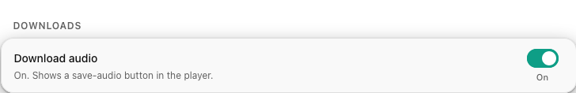

# Saving audio

Sometimes you just want the file. YouTube Audio can save the current track as a
single, tidy `.m4a` that plays just about anywhere, from a button right in the
player.

<figure class="shot" markdown>

</figure>

## Turn it on first

Download is **off until you ask for it**, so the player stays uncluttered for
people who never need it. Flip the **Download audio** toggle in settings and a
save button appears next to the audio button in the player.

## What you get

Press it and the add-on fetches a fresh audio stream, picks the widely
compatible AAC format, and hands the file to Firefox's own downloads. You end up
with one clean `.m4a`, named from the track, that opens in any music app.

The button shows you where it is: it spins while the file is being fetched,
shows a check when it lands, and, if something goes wrong, tells you plainly
instead of leaving a pile of half-finished files behind.

<ul class="yta-promise">
<li><strong>One track, one file.</strong> No stray fragments, no leftovers.</li>
<li><strong>Plays anywhere.</strong> Standard AAC audio in an <code>.m4a</code> container.</li>
<li><strong>Credentialless, like everything else.</strong> The fetch that grabs the audio carries none of your cookies.</li>
</ul>

Next: [a tidier YouTube :material-arrow-right:](cleaner.md)
