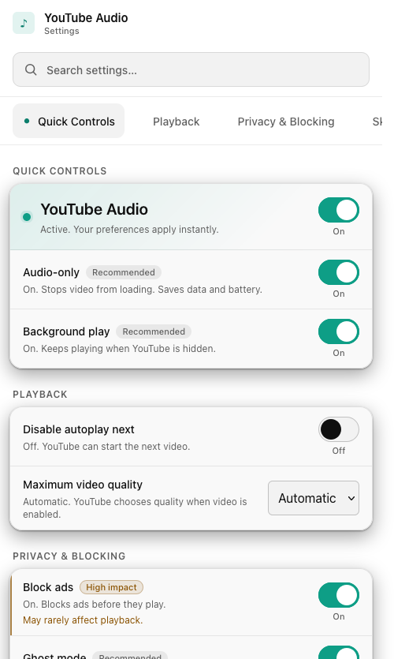

# On your phone

Firefox for Android gets the whole thing, not a stripped-down version. The same
add-on, the same identity, the same features, laid out for a touchscreen. For a
lot of people this is where audio-only earns its keep: a locked phone in a
pocket, playing a mix, sipping battery instead of gulping it.

<figure class="frame-phone" markdown>

</figure>

## Built for touch

On Android the interface folds into a single, scrollable column with the quick
controls right at the top, so audio-only, background play, and pause are the
first things you reach. The buttons in the player are sized for fingers rather
than a mouse pointer.

## Background play, where it matters most

Locking your phone is exactly when you do not want the video to keep
downloading. Background play keeps the sound going with the screen off, and your
lock-screen controls keep working because the add-on never touches the native
media session. Put it in your pocket and keep walking.

## Holding on through YouTube's tricks

The mobile player does some things the desktop one does not, like swapping out
its own video element mid-playback to reclaim control. The add-on watches for
that and re-applies audio-only cleanly when it happens, so a track does not
suddenly jump back to video or reset its position. That resilience is covered in
[How it works](../architecture/README.md).

## Getting it on Android

Production installs and updates through the AMO listing, the same as desktop.
For beta builds, use Firefox's **Install extension from file** and pick the
signed `.xpi`. The full details are in [Install](install.md).

Next: [privacy :material-arrow-right:](privacy.md)
