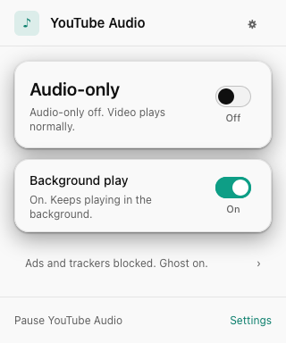
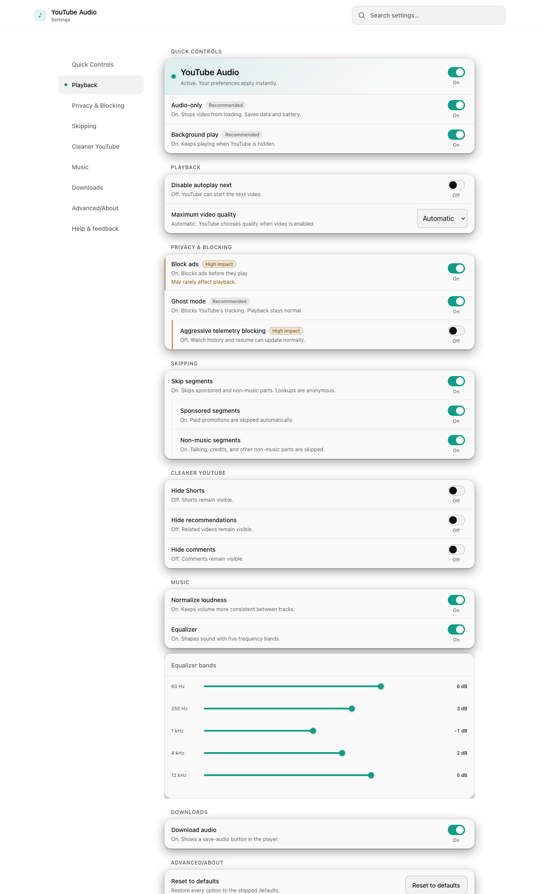
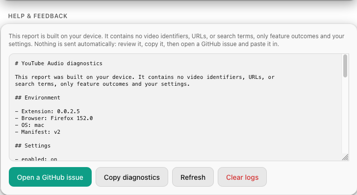

# The popup and settings

Everything is one click away, and nothing hides. The popup handles the day-to-day
switches; the settings page holds every knob, grouped and searchable.

## The popup

Click the toolbar icon and you get the essentials: whether audio-only is on for
this video, background play, and a one-line summary of what is being blocked,
with a pause switch and a link to full settings at the bottom.

<figure class="frame-popup" markdown>

</figure>
<figure class="frame-popup" markdown>

</figure>

### It tells you the truth

This is the part worth dwelling on. The status line is not just echoing your
setting back at you. It reflects what actually happened to **this** video on the
page. If a video quietly fell back to normal YouTube, the popup says so, rather
than showing a green light that is not true.

<figure class="frame-popup" markdown>

</figure>

So the three panels above are all honest: audio-only is genuinely active,
genuinely off, or the video genuinely cannot be played as audio and is on normal
YouTube. You never have to wonder which.

## The settings page

The full settings page keeps everything in one place, grouped into plain
sections with a live search box at the top. Type "loudness" or "shorts" and it
narrows to just the matching rows. On a phone the quick controls sit right at
the top, so the things you touch most are always in reach.

<figure class="frame-browser" markdown>

</figure>

The groups map straight onto the rest of this guide:

<ul class="yta-promise">
<li><strong>Quick Controls.</strong> Pause the whole add-on, audio-only, and background play.</li>
<li><strong>Playback.</strong> Disable autoplay-next and cap the video quality.</li>
<li><strong>Privacy and Blocking.</strong> Ads, Ghost mode, and aggressive telemetry.</li>
<li><strong>Skipping.</strong> Segment skipping and its categories.</li>
<li><strong>Cleaner YouTube.</strong> Hide Shorts, recommendations, or comments.</li>
<li><strong>Music.</strong> Loudness normalization and the equalizer.</li>
<li><strong>Downloads.</strong> Show the save-audio button in the player.</li>
</ul>

Every switch takes effect instantly, and there is a **Reset to defaults** if you
ever want to start clean.

## If something breaks

Down in **Help and feedback**, a built-in reporter assembles a readable
diagnostics log: your environment, a snapshot of your settings, and the last few
things that happened. You can read every word of it before it goes anywhere.

<figure class="shot" markdown>

</figure>

Copy it, open a GitHub issue with it, or clear it. The log records only plain
facts, never what you watched, searched for, or typed. There is more on that in
[Privacy](privacy.md).

Next: [on your phone :material-arrow-right:](mobile.md)
