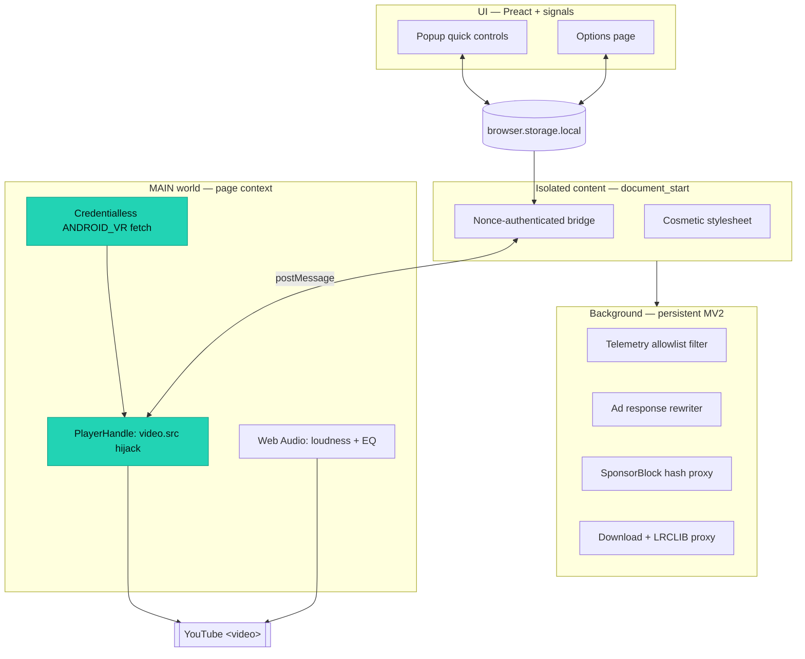

:material-firefox: Firefox &middot; Desktop + Android

<h1 class="yta-hero__title">Stream only the audio from YouTube</h1>

A razor-focused, privacy-first extension that plays YouTube and YouTube Music
as pure audio. It fetches a direct audio stream with no login, hijacks the
page <code>&lt;video&gt;</code> element, and keeps playing in the background
while it blocks ads and telemetry, skips sponsored segments, and adds real
YouTube Music power features.

[:material-firefox: Install for Firefox](https://github.com/animeshkundu/youtube-audio#install){ .md-button .md-button--primary }
[:fontawesome-brands-github: View on GitHub](https://github.com/animeshkundu/youtube-audio){ .md-button }
[:material-sitemap: Explore the architecture](architecture/README.md){ .md-button }

## What it does

- :material-music-note:{ .lg .middle } **Audio-only, no video decode**

  ***

  A credentialless `ANDROID_VR` request returns a direct audio URL, and
  `PlayerHandle` swaps it into the page `<video>`. No video frames are
  decoded, so battery, heat, and bandwidth all drop sharply.

- :material-play-box-multiple:{ .lg .middle } **Background & lock-screen play**

  ***

  Playback keeps running when the tab is hidden or the phone is locked,
  with OS media controls wired through the Media Session API.

- :material-shield-off:{ .lg .middle } **Ghost mode: ad & telemetry block**

  ***

  An allowlist `webRequest` filter drops first-party YouTube telemetry, and
  a response rewriter strips ad descriptors from InnerTube `player` / `next`
  responses. Everything fails open to native playback.

- :material-skip-next:{ .lg .middle } **Private segment skipping**

  ***

  SponsorBlock ranges are fetched by a four-character hash prefix with
  credentials omitted, so no plaintext video ID ever leaves the browser.

- :material-equalizer:{ .lg .middle } **YouTube Music power features**

  ***

  One shared Web Audio graph applies per-track loudness normalization and a
  five-band equalizer, with opt-in timed lyrics from LRCLIB.

- :material-download:{ .lg .middle } **One-tap audio download**

  ***

  An off-by-default in-player control grabs the preferred direct audio
  format and hands a validated URL and sanitized filename to the downloads
  API.

## Under the hood

YouTube Audio runs as four cooperating layers built from a single strict
TypeScript source tree (WXT + Preact), shipping as a Firefox Manifest V2
extension. Each feature fails open: if anything breaks, native YouTube keeps
working.

- **MAIN world** is the only layer that touches page-owned player APIs. It owns
  the credentialless fetch, the `<video>.src` hijack, and the Web Audio graph.
- **Isolated content** owns extension storage and the nonce-authenticated
  bridge, and injects one cosmetic stylesheet for quality-of-life tweaks.
- **Background** owns every privileged API: the telemetry allowlist, the ad
  response filter, the SponsorBlock hash proxy, and download / lyrics proxies.
- **UI** is a Preact popup and options page over one storage-backed settings
  model, with quick controls surfaced first for Firefox Android.

[Read the full architecture :material-arrow-right:](architecture/README.md){ .md-button }

## Explore the docs

- :material-sitemap:{ .lg .middle } **Architecture**

  ***

  Layer responsibilities, security boundaries, and per-milestone data-flow
  diagrams for every feature.

  [:octicons-arrow-right-24: System design](architecture/README.md)

- :material-file-document-multiple:{ .lg .middle } **Specifications**

  ***

  The "no spec, no code" contracts for milestones M0 through M7, from the
  foundation to release infrastructure.

  [:octicons-arrow-right-24: SPEC-001 to SPEC-011](specs/README.md)

- :material-gavel:{ .lg .middle } **Decisions (ADRs)**

  ***

  Why WXT + TypeScript + Preact, and how single-ID AMO-listed distribution,
  the unlisted beta channel, and AMO preflight are structured.

  [:octicons-arrow-right-24: Architecture decisions](adrs/README.md)

- :material-flask:{ .lg .middle } **Research**

  ***

  The deep dives behind each feature: streaming internals, ad blocking,
  ghost mode, `ANDROID_VR`, mobile support, and more.

  [:octicons-arrow-right-24: Research notes](research/01-disable-video-audio-only.md)

- :material-history:{ .lg .middle } **Project History**

  ***

  Milestone handoffs (M0 to M7) plus live and mobile Firefox verification
  results.

  [:octicons-arrow-right-24: Handoffs & verification](history/README.md)

- :material-robot:{ .lg .middle } **Agent Instructions**

  ***

  The documentation-driven protocols this AI-enabled repository follows for
  every change.

  [:octicons-arrow-right-24: Working agreement](agent-instructions/README.md)

## Milestone map

| Milestone | Feature                  | Specification                                           | Handoff                                                    |
| --------- | ------------------------ | ------------------------------------------------------- | ---------------------------------------------------------- |
| M0        | Extension foundation     | [SPEC-001](specs/SPEC-001-m0-foundation.md)             | [Handoff](history/2026-07-11-m0-foundation.md)             |
| M1        | Core audio-only playback | [SPEC-002](specs/SPEC-002-m1-core-playback.md)          | [Handoff](history/2026-07-11-m1-core-playback.md)          |
| M2a       | Ghost telemetry blocking | [SPEC-003](specs/SPEC-003-m2a-ghost-telemetry.md)       | [Handoff](history/2026-07-11-m2a-ghost-telemetry.md)       |
| M2b       | YouTube ad blocking      | [SPEC-004](specs/SPEC-004-m2b-ad-block.md)              | [Handoff](history/2026-07-11-m2b-ad-block.md)              |
| M3a       | Private segment skipping | [SPEC-005](specs/SPEC-005-m3a-segment-skipping.md)      | [Handoff](history/2026-07-11-m3a-segment-skipping.md)      |
| M3b       | Quality-of-life controls | [SPEC-006](specs/SPEC-006-m3b-quality-of-life.md)       | [Handoff](history/2026-07-11-m3b-quality-of-life.md)       |
| M4        | YouTube Music extras     | [SPEC-007](specs/SPEC-007-m4-youtube-music-extras.md)   | [Handoff](history/2026-07-11-m4-youtube-music-extras.md)   |
| M5        | Audio download           | [SPEC-008](specs/SPEC-008-m5-audio-download.md)         | [Handoff](history/2026-07-11-m5-audio-download.md)         |
| M6        | Design polish            | [SPEC-009](specs/SPEC-009-m6-design-polish.md)          | [Handoff](history/2026-07-11-m6-design-polish.md)          |
| M7        | Release infrastructure   | [SPEC-010](specs/SPEC-010-m7-release-infrastructure.md) | [Handoff](history/2026-07-11-m7-release-infrastructure.md) |

!!! tip "New here?"
Start with the [Architecture](architecture/README.md) overview for the big
picture, then dive into any [Specification](specs/README.md) for the exact
contract behind a feature.
