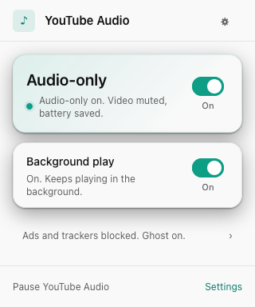
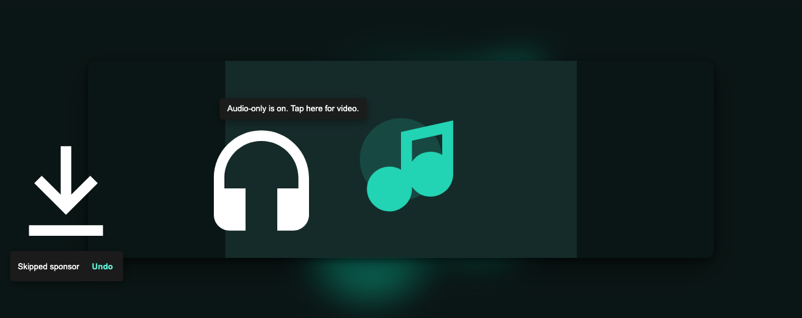
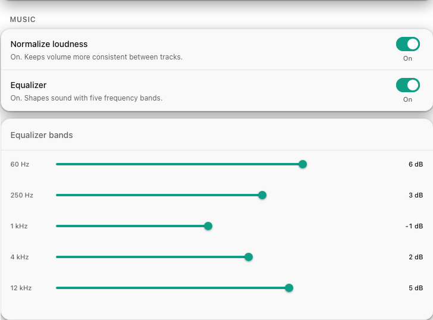
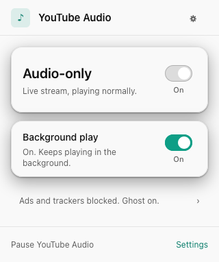
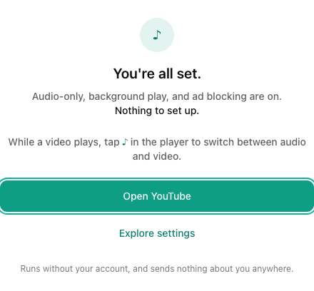

:material-firefox: Firefox &middot; Desktop + Android

<h1 class="yta-hero__title">YouTube, just the sound</h1>

A Firefox add-on that plays YouTube and YouTube Music as audio only, so your
battery and your mobile data last a lot longer. No account, no sign-in,
nothing to configure to get started.

[:material-firefox: Install for Firefox](guide/install.md){ .md-button .md-button--primary }
[:material-compass-outline: Take the tour](guide/audio.md){ .md-button }

<figure class="frame-popup yta-hero__showcase">
  
</figure>

Runs while you are signed out. It never needs, reads, or touches your YouTube account.

Play a three hour mix in a tab you never look at, and normally YouTube keeps
shovelling video down your connection the whole time. Install this, and that
stops. The picture goes, the sound stays, and your laptop stops running warm.

Let YouTube be the radio it always wanted to be.

## Audio, not video

<figure class="shot" markdown>

<figcaption>Audio mode shows the track artwork instead of a black rectangle. Shown on the project's local test page.</figcaption>
</figure>

Most of what YouTube sends down your connection is video you are not even
looking at. YouTube Audio points the player at a direct audio stream and stops
the video download at its source. Same native player, same controls, far less
battery and data.

When you do want the picture back, one tap on the audio button in the player
brings it back at the exact spot you were listening, playing or paused.

<figure class="shot" markdown>

</figure>

### No ads, no tracking

Ads and tracking pings get blocked before they leave your browser, quietly,
without you asking. Ghost mode drops YouTube's telemetry, and the ad blocker
strips ad slots out of the player response so the native player has nothing to
play.

Both fail open. If anything ever looks off, playback falls straight back to
normal YouTube. No broken player, ever.

<figure class="shot" markdown>

</figure>

### Skip the boring bits

Auto-skip glides past sponsor reads and off-topic music intros. The clever
part is the privacy: only a tiny four-character hash of the video ever leaves
your machine to look segments up, a hash shared by thousands of other videos,
so nobody learns what you are watching.

<figure class="shot" markdown>

</figure>

### YouTube Music, leveled up

Loudness normalization evens out the loud-and-quiet track problem, so you are
not forever reaching for the volume knob between songs. A five-band equalizer
lets you shape the sound to taste: more bass, brighter highs, whatever you
like.

Both are one click away in settings, and they only touch YouTube Music.

## The popup tells you the truth

<figure class="frame-popup" markdown>

</figure>
<figure class="frame-popup" markdown>

</figure>

The status you see is the real state of the current video, pulled from what
actually happened on the page, not from a setting you flipped once.

So when a video cannot play as audio only, a live stream, a members-only
upload, something made for kids, the popup says so, instead of showing you a
green light that is lying. You always know exactly what is going on.

## How it works, in one picture

There is no magic, and no server of ours in the loop. The add-on asks YouTube's
own player for a plain audio stream, without your cookies, and quietly points
the page's video element at it. Everything else, blocking, skipping, loudness,
is a small layer on top that gets out of the way the moment it cannot help.

  

    1
    <h3>Ask YouTube for audio</h3>
    
A quiet, cookie-free request for a direct audio stream, the moment you open a video.

  

  

  

    2
    <h3>Swap the page player</h3>
    
The native player gets pointed at that stream. Same controls, same shortcuts, nothing rebuilt.

  

  

  

    3
    <h3>Video bytes stop</h3>
    
The picture goes, the sound stays, and your battery and data plan both notice.

  

[Read the full architecture, with diagrams :material-arrow-right:](architecture/README.md){ .md-button }

## Everything else it does

- :material-lock-outline:{ .lg .middle } **Background and lock-screen play**

    ***

    Lock the phone or switch tabs and the audio carries on, with your usual OS
    and lock-screen media controls.

- :material-download-outline:{ .lg .middle } **Save a track**

    ***

    Download the current audio as a single, tidy `.m4a` file that plays just
    about anywhere. Off until you turn it on.

- :material-broom:{ .lg .middle } **A tidier YouTube**

    ***

    Optionally hide Shorts, recommendations, or comments, cap the video
    quality, or switch off autoplay-next.

- :material-cellphone:{ .lg .middle } **Made for your phone**

    ***

    Firefox for Android is a first-class target, not an afterthought, with
    touch-friendly controls and full feature parity.

- :material-eye-off-outline:{ .lg .middle } **Collects nothing**

    ***

    No analytics, no phone-home. The add-on declares no data collection, and
    the media it fetches is requested without your cookies.

- :material-lifebuoy:{ .lg .middle } **Honest diagnostics**

    ***

    If something breaks, a built-in reporter builds a readable log you can
    check word for word. Nothing personal is in it.

## Built for you, not for data

<figure class="shot" markdown>

</figure>

We cannot see what you watch. There is no account, no server of ours, and no
analytics, so there is nothing to leak and nothing to sell.

<ul class="yta-promise">
<li><strong>Logged out, always.</strong> Everything works while you are signed out, on purpose. The extension never attaches your YouTube login.</li>
<li><strong>No cookies on the wire.</strong> Every request it makes to fetch your audio goes out without them.</li>
<li><strong>Falls back gracefully.</strong> Anything it cannot play as audio only just hands you back to normal YouTube.</li>
<li><strong>Free and open source.</strong> GPL-3.0, built in the open. Read every line if you like.</li>
</ul>

## Give it a spin

Put your headphones on and let that playlist run without cooking your
battery. The essentials are on out of the box. The rest waits until you ask.

[:material-firefox: Install for Firefox](guide/install.md){ .md-button .md-button--primary }
[:material-book-open-variant: Read the guide](guide/install.md){ .md-button }

Firefox 128 and up, on desktop and Android.

## Common questions

??? question "Does it work while I am logged into YouTube?"
    It is built for signed-out use, and that is the only supported mode. It
    never reads or touches your YouTube account. If a video needs a login to
    play, it simply falls back to normal YouTube.

??? question "What happens with live streams or age-restricted videos?"
    Those cannot be played as a plain audio stream, so the add-on hands you
    back to normal YouTube playback. The popup tells you when this happens, so
    you are never left wondering.

??? question "Is any of this sent anywhere?"
    No analytics, no phone-home. The only things that leave your browser are
    the cookie-free request that fetches your audio and, if you enable segment
    skipping, a four-character hash used to look up sponsor segments. See
    [Privacy](guide/privacy.md) for the full picture.

??? question "Chrome or other browsers?"
    Not today. The add-on relies on Firefox's blocking network APIs, which
    Chrome's current extension platform no longer offers. Firefox desktop and
    Firefox for Android are the supported targets.

??? question "How do I get it?"
    See [Install](guide/install.md) for desktop and Android, including
    building from source and the beta channel.

